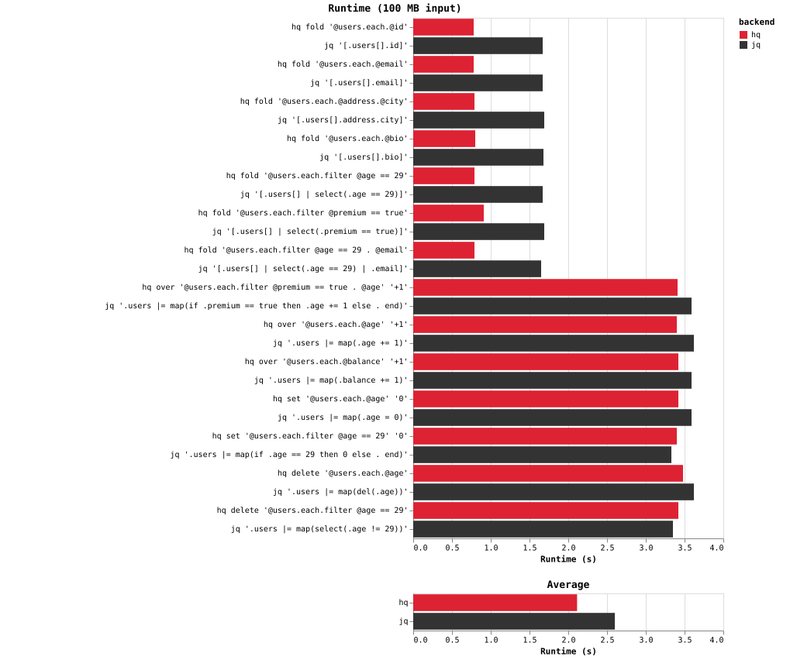
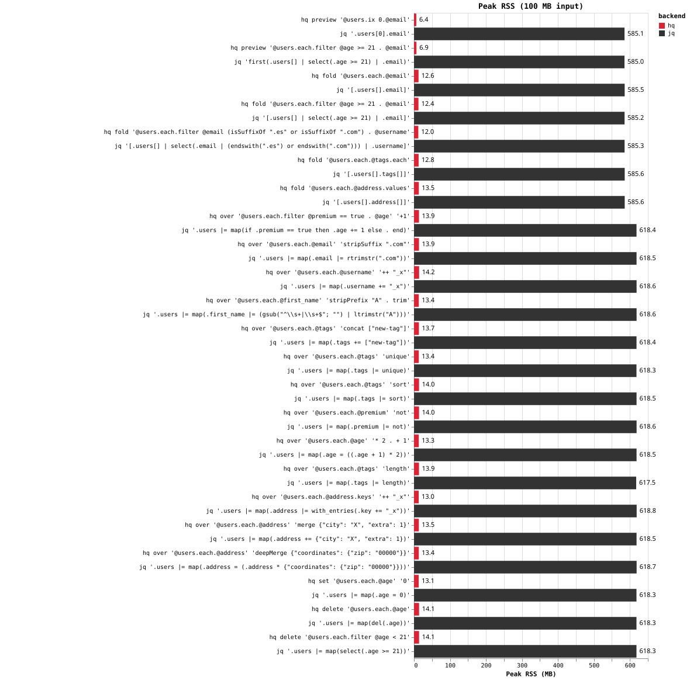

# hq

`hq` is a JSON processor inspired by `jq`. It queries JSON with optics and
rewrites values with transformations, streaming input so large documents
never load fully into memory.

## Usage

```sh
hq [OPTIONS] COMMAND OPTIC [ARGS] < input.json
```

```text
hq --help

hq v0.0.0.1

Usage: hq [-f|--file FILE] [-r|--raw] [-c|--compact] [-j|--join] COMMAND

  Query JSON using optics

Available options:
  -f,--file FILE           Input JSON file, or '-' for stdin
  -r,--raw                 Print strings without JSON quotes
  -c,--compact             Print compact JSON
  -j,--join                Print without separators
  -h,--help                Show this help text

Available commands:
  fold                     
  preview                  
  set                      
  over                     
  delete                   

OPTIC LANGUAGE

  Optics select and traverse JSON values. Optics are composed with .;
  each component focuses on a new set of values.
  
  @field : Focus an object field
  each : Focus every element of an array
  keys : Focus every key of an object
  values : Focus every value of an object

  Examples:

  @name : Focus the "name" field.
  
  @users . each . @name : Focus the "name" field of every element in "users".
  
  @users . each . @age : Focus the "age" field of every element in "users".
  
  Optics can be used with different queries:
  
  fold OPTIC : Print every value focused by the optic.
  
  preview OPTIC : Print the first value focused by the optic.
  
  set OPTIC VALUE : Replace every focused value with VALUE.
  
  over OPTIC TRANSFORMATION : Transform every focused value.
  
  delete OPTIC : Delete every focused value.

TRANSFORMATIONS
  
  Transformations describe how a focused value is changed. They can be
  composed and can themselves use optics to obtain values from the input.
  
  For example:
  
  over '@users . each . @age' '(+ 1)'
  
  increments every user's age.
```

Commands:

| Command | Meaning |
| --- | --- |
| `fold OPTIC` | Print every value the optic focuses on |
| `preview OPTIC` | Print at most the first focused value |
| `over OPTIC TRANSFORMATION` | Rewrite each focused value in place |
| `set OPTIC VALUE` | Replace each focused value (`over` with a constant) |
| `delete OPTIC` | Remove each focused value |

Options: `-f FILE` (input file, `-` for stdin), `-r` (raw strings), `-c`
(compact output), `-j` (no separators), `-0` (use `null` as input).

## Optics

| Optic | Meaning |
| --- | --- |
| `@name` | Field of an object |
| `each` | Each array element, or each object value |
| `keys` | Each object key as a string (objects only) |
| `values` | Each object value (objects only) |
| `id` | The whole value (unit of `.`) |
| `_String` | Focus if the value is a string |
| `_Number` | Focus if the value is a number |
| `_Bool` | Focus if the value is a boolean |
| `_Null` | Focus if the value is null |
| `_Array` | Focus if the value is an array |
| `_Object` | Focus if the value is an object |
| `_Just` | Focus if the value is non-null |
| `ix N` | Array element at index `N` (arrays only) |
| `filter O T` | Keep the input when `T` holds for some focus of `O` |
| `A . B` | Composition: focus `A`, then `B` within each target |

Example: `filter @age '== 30'` keeps objects with `age` 30;
`filter (each.@age '== 30')` keeps documents containing one.

## Transformations

| Transformation | Meaning |
| --- | --- |
| `+N` | Add number `N` |
| `*N` | Multiply by number `N` |
| `-N` | Subtract number `N` |
| `/N` | Divide by number `N` |
| `++"s"` | Append string `s` |
| `concat [...]` | Append array elements |
| `trim` | Strip surrounding whitespace from a string |
| `not` | Negate a boolean |
| `replace "a" "b"` | Replace occurrences of `a` with `b` in a string |
| `== VALUE` or `= VALUE` | Test equality with a JSON value (yields a boolean) |
| `const VALUE` | Replace with `VALUE` regardless of input |
| `A or B` / `A \|\| B` | Boolean disjunction of two transformations |
| `A . B` | Composition: apply `B` first, then `A` over its result |

## Examples

```sh
echo '{"name":"ada","age":36}' | hq fold '@name'
# "ada"

echo '{"a":[1,2,3]}' | hq fold '@a.each'
# 1 2 3 (one per line, pretty-printed)

echo '{"a":1}' | hq over '@a' '+1' -c
# {"a":2}

echo '{"a":1,"b":2}' | hq delete '@b' -c
# {"a":1}
```

## Performance

On the 100 MB `hq-bench-data` benchmark (`bench/bench.sh`), reads
(`fold`) run at ~0.4x jq's runtime and rewrites (`over`/`set`/`delete`)
at \~1.2x, at \~12 MB peak RSS versus jq's \~600 MB.




